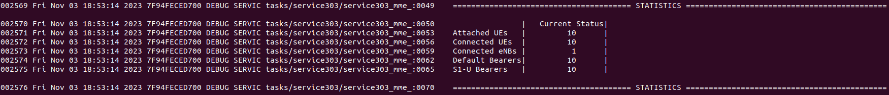

# 4G-OAI
4G Network, base on OAI. 
for run OAI 4G Network:
first we need install docker & docker compose, after we can pull docker images.
install Docker and Docker compose:
```bash
sudo apt install -y git net-tools putty

# https://docs.docker.com/engine/install/ubuntu/
sudo apt install -y ca-certificates curl gnupg
sudo install -m 0755 -d /etc/apt/keyrings
curl -fsSL https://download.docker.com/linux/ubuntu/gpg | sudo gpg --dearmor -o /etc/apt/keyrings/docker.gpg
sudo chmod a+r /etc/apt/keyrings/docker.gpg
echo "deb [arch="$(dpkg --print-architecture)" signed-by=/etc/apt/keyrings/docker.gpg] https://download.docker.com/linux/ubuntu "$(. /etc/os-release && echo "$VERSION_CODENAME")" stable" | sudo tee /etc/apt/sources.list.d/docker.list > /dev/null
sudo apt update
sudo apt install -y docker-ce docker-ce-cli containerd.io docker-buildx-plugin docker-compose-plugin

# Add your username to the docker group, otherwise you will have to run in sudo mode.
sudo usermod -a -G docker $(whoami)
reboot
```
Pull Docker images.
```bash
$ docker pull cassandra:2.1
$ docker pull redis:6.0.5
$ docker pull oaisoftwarealliance/oai-hss:latest
$ docker pull oaisoftwarealliance/magma-mme:latest
$ docker pull oaisoftwarealliance/oai-spgwc:latest
$ docker pull oaisoftwarealliance/oai-spgwu-tiny:latest
$ docker pull oaisoftwarealliance/trf-gen-cn5g:latest

$ docker pull ooaisoftwarealliance/oai-enb:2022.w46
$ docker pull oaisoftwarealliance/oai-lte-ue:2022.w46
```
or use below script:
```console
# in 4G-OAI Directory
$ sudo chmod +x get.sh
$ sudo ./get.sh
```
clone this repository,
```bash
$ git clone https://github.com/Alirezaemx/4G-OAI.git
```
we can run 4G core with below Command.
```bash
$ cd 4G-OAI
$ sudo chmod +x entrypoint.sh
$ sudo chmod +x core.sh
$ sudo ./core.sh
```
we can see docker container status.
```bash
$ sudo docker ps -a
```
* that all containers must be in up.

command For MME logs:
```bash
$ sudo chmod +x log.sh
$ sudo ./log.sh
```
After that, we can run the software eNB & Ue part.
```bash
# in 4G-OAI Directorty
$ sudo chmod +x ran.sh
$ sudo ./ran.sh
```
If all the steps are done correctly, we should have such a result.
<p align="center">
  
</p>

For Unemployment: 
```console
# in 4G-OAI Directory
$ sudo docker-compose down
```
